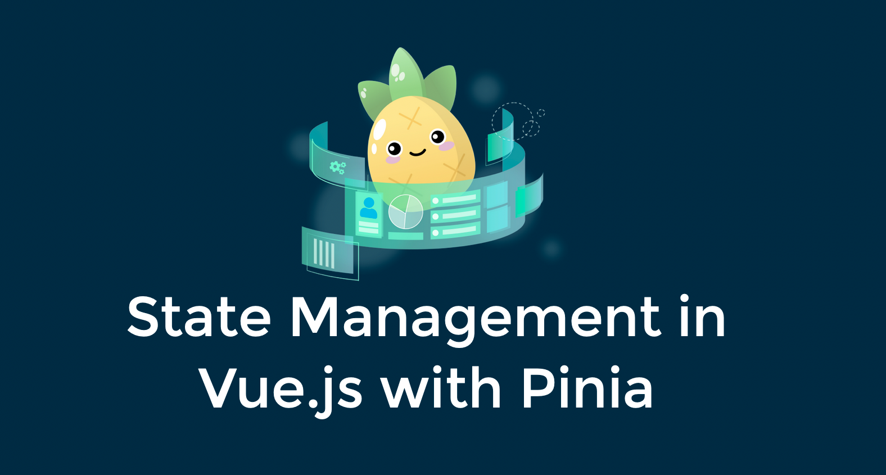

# Pinia Workshop Boilerplate Code

### How to Use

1. Download Boilerplate Code
2. Ensure you're on Node v16.x.x (LTS)
3. Go ahead and run `npm install` before conference so everyone isn't downloading dependencies at once
4. Get excited for the coming workshop!
